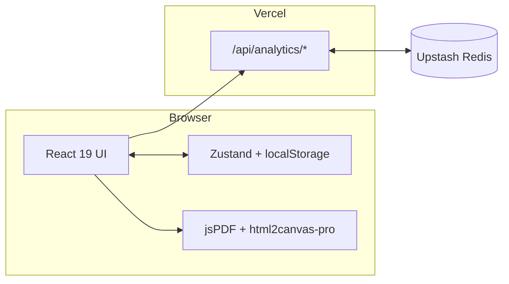

<div align="center">

# MaakMijnCV

**A free, ATS-friendly CV builder for jobseekers in the Netherlands.**
_Built for the [Cybersoek CyberCafé Werk](https://cybersoek.nl/ons-aanbod/cybercafe-werk/) programme in Amsterdam._

[](https://cv-maker-red-sigma.vercel.app/)
[](LICENSE)
[](https://nextjs.org)
[](https://www.typescriptlang.org)
[](https://tailwindcss.com)

<br/>

<a href="https://cv-maker-red-sigma.vercel.app/">
  
</a>

<sub>No sign-up · No paywall · Data never leaves your browser</sub>

</div>

---

## Overview

Most online CV builders in the Netherlands are paywalled, require an account, or produce layouts that ATS scanners silently reject. **MaakMijnCV** runs entirely in the browser — pick a template, fill in the details, download an A4 PDF. In under five minutes, with no PII ever hitting a server.

Built pro bono for jobseekers in the [Cybersoek](https://cybersoek.nl) programme in Amsterdam. Solo project: design, engineering, and deployment.

---

## Features

| | |
| :--- | :--- |
| **14 templates** | 10 industry-specific (healthcare, hospitality, tech, retail, education, admin, delivery, housekeeping, construction) + minimal, modern, corporate, creative, creative-bold |
| **ATS-friendly** | Semantic HTML structure that passes automated scanners |
| **PDF export** | Client-side A4 export via `jspdf` + `html2canvas-pro`, pixel-accurate to the preview |
| **Drag-and-drop** | Reorder experience items with `@dnd-kit` |
| **Autosave** | Zustand `persist` — progress survives reloads |
| **60-minute TTL** | `localStorage` wiped after an hour of inactivity — safe on shared machines |
| **Cover letter** | Matching companion document |
| **Bilingual** | Nederlands and English via an in-house `i18n` provider |
| **NL fields** | Optional date of birth, nationality, work eligibility, driving licence, BIG, AGB |

---

## Screenshots

| Landing | Editor & live preview |
| :---: | :---: |
| [](https://cv-maker-red-sigma.vercel.app/) | [](https://cv-maker-red-sigma.vercel.app/builder) |

---

## Tech Stack

**Framework:** Next.js 16 (App Router) · React 19 · TypeScript 5
**UI:** Tailwind CSS 4 · Radix UI · lucide-react
**State:** Zustand 5 (`persist` → `localStorage`)
**PDF:** jspdf + html2canvas-pro (client-side)
**DnD:** @dnd-kit
**Analytics:** Upstash Redis (counters) · Vercel Analytics (page views)
**Hosting:** Vercel

---

## Architecture

Client-heavy Next.js app. All CV data lives in the browser; the server handles two thin analytics endpoints. No user database, no auth for end users, no server-side rendering of user content.



<details>
<summary><strong>Why client-side only?</strong></summary>

Zero backend surface means zero PII risk — candidate data never leaves the device unless they export a PDF themselves. It also removes the sign-up barrier, which matters for the target audience.

</details>

<details>
<summary><strong>Why <code>html2canvas-pro</code> + <code>jsPDF</code> instead of a headless renderer?</strong></summary>

Server-side PDF rendering requires serverless Chromium — heavy cold starts and higher cost, with no upside when the data flow is already client-only. Rasterising the DOM to canvas gives a 1:1 export with zero round trips. `html2canvas-pro` handles modern CSS (OKLCH, subgrid) that upstream `html2canvas` cannot.

</details>

---

## Project Structure

```text
src/
├── app/
│   ├── analytics/            # Password-gated admin dashboard
│   ├── api/analytics/        # track (POST) + stats (GET/POST, gated)
│   ├── builder/              # /builder — the editor
│   ├── layout.tsx
│   └── page.tsx              # Marketing landing page
├── components/
│   ├── builder/              # Editor shell, toolbar, template picker
│   ├── coverletter/          # Cover letter editor + preview
│   ├── editor/               # Form sections
│   ├── preview/              # Live CV preview
│   ├── templates/            # 14 template implementations
│   └── ui/                   # Radix-backed primitives
└── lib/
    ├── cv-types.ts           # Domain model
    ├── i18n.tsx              # LocaleProvider (nl / en)
    ├── pdf.ts                # downloadCVAsPdf()
    ├── session.ts            # 60-minute inactivity → wipe localStorage
    └── store.ts              # Zustand store
```

---

## API

Two Node-runtime routes under `/api/analytics/*`.

**`POST /api/analytics/track`** — anonymous event recorder, no auth.

```http
POST /api/analytics/track
Content-Type: application/json

{ "type": "download" }   // "download" | "print"
```

Responses: `200 { ok: true }` · `400 invalid_body|invalid_type` · `500 write_failed`.

**`GET /api/analytics/stats`** — password-gated. Send the password via `x-analytics-password` header (or a JSON body on `POST`).

```jsonc
{
  "version": 1,
  "totals": { "download": 1287, "print": 42 },
  "byDay": { "2026-07-01": { "download": 12, "print": 1 } }
}
```

---

## Deployment

Deployed on **Vercel** with automatic builds on push to `master` and preview deploys per PR. Self-hosting works on any Node 20+ host — `npm run build && npm run start`.

---

## Security & Privacy

- **No server-side storage of candidate data** — everything is in the browser.
- **Session TTL** — managed `localStorage` keys wiped after 60 minutes of inactivity ([`src/lib/session.ts`](src/lib/session.ts)).
- **Analytics scope** — two counters only (`download`, `print`). No user IDs, no CV content, no IPs.
- **Known issue:** the analytics admin route falls back to a hard-coded default when `ANALYTICS_PASSWORD` is unset. Always override in deployed environments. Fail-closed fix is on the roadmap.

---

## Roadmap

**Done:** 14 templates · PDF export · autosave with 60-min TTL · DnD reordering · NL/EN · cover letter · anonymous analytics · admin dashboard.

**Next:** fail-closed analytics password · Vitest + Playwright · GitHub Actions CI · Lighthouse report · rate limiting on `/api/analytics/track` · mobile/tablet screenshots.

**Later:** more locales (AR-RTL, TR, PL, UK) · LinkedIn import · AI bullet rewriter · shareable preview links · `.docx` export.

---

## FAQ

<details>
<summary><strong>Is my CV data saved to a server?</strong></summary>

No. Everything lives in your browser's `localStorage`. The server sees only anonymous counters when you export or print. Clear browser data and your CV is gone — there is no cloud copy.

</details>

<details>
<summary><strong>Are the templates really ATS-friendly?</strong></summary>

Templates avoid patterns that break ATS parsers — no multi-column headers, no text inside images, semantic HTML. If a specific ATS mis-parses one, please open an issue.

</details>

<details>
<summary><strong>How do I add a new template?</strong></summary>

Add the ID to the union in [`src/lib/cv-types.ts`](src/lib/cv-types.ts), create a component in [`src/components/templates/`](src/components/templates/), register it in [`index.tsx`](src/components/templates/index.tsx), and add labels to [`src/lib/i18n.tsx`](src/lib/i18n.tsx).

</details>

---

## Acknowledgements

[Cybersoek](https://cybersoek.nl) for the mission · [Radix UI](https://www.radix-ui.com), [Vercel](https://vercel.com), [Upstash](https://upstash.com), [lucide-react](https://lucide.dev) for the building blocks · the Cybersoek coaches for template feedback.

---

## Author

Designed, built, and maintained by **[Yevhen Uhnivenko](https://github.com/EuvhenRight)** — full-stack developer based in Amsterdam.

**GitHub:** [@EuvhenRight](https://github.com/EuvhenRight) · **Email:** [ugnivenko.ea@gmail.com](mailto:ugnivenko.ea@gmail.com)

---

## License

[MIT](LICENSE) © [Yevhen Uhnivenko](https://github.com/EuvhenRight) · built for [Cybersoek](https://cybersoek.nl).
