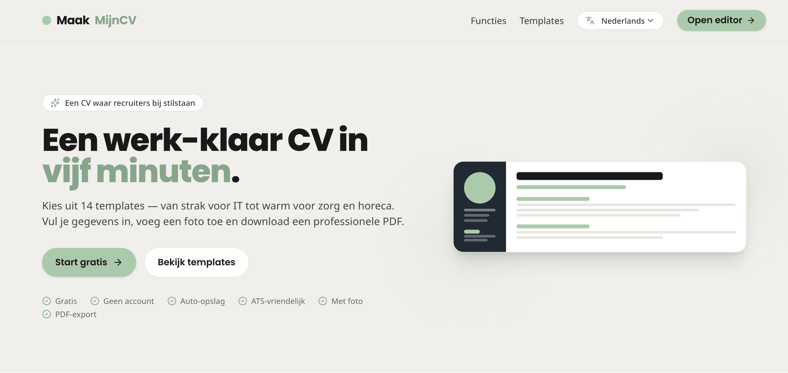
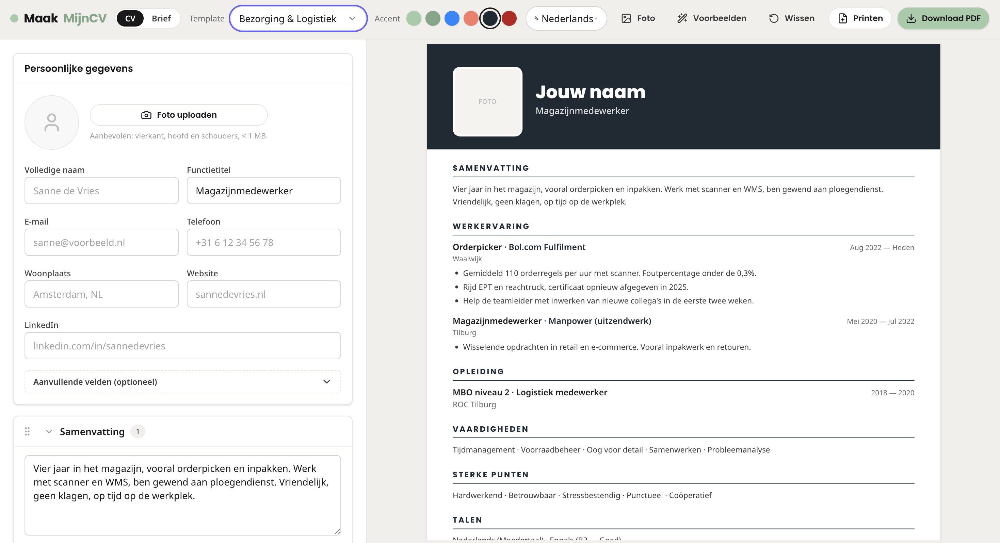

# MaakMijnCV — CV Builder for Cybersoek

**A free, fast, ATS‑friendly CV builder built for jobseekers in the Cybersoek / CyberCafé Werk programme.**

[](https://cv-maker-red-sigma.vercel.app/)
[](https://cybersoek.nl/ons-aanbod/cybercafe-werk/)
[](https://nextjs.org)
[](https://react.dev)
[](https://www.typescriptlang.org)
[](https://tailwindcss.com)

| [](https://cv-maker-red-sigma.vercel.app/) | [](https://cv-maker-red-sigma.vercel.app/builder) |
| :---: | :---: |
| **Landing page** | **Editor — live preview, accents, language & PDF export** |

---

## About

**MaakMijnCV** is the CV builder behind the [CyberCafé Werk programme at Cybersoek](https://cybersoek.nl/ons-aanbod/cybercafe-werk/) — a Dutch initiative that helps people get back to work through digital skills, coaching and free tooling.

The app lets candidates pick a recruiter‑approved template, fill in their details and download a polished PDF in under five minutes. No account, no paywall, autosave to the browser, full multilingual support.

## Features

- **15+ templates** — industry‑specific layouts (Healthcare, Hospitality, Construction, Tech, Retail, Education, …) plus classic, modern, minimal, creative and corporate styles.
- **ATS‑friendly output** — clean semantic structure that passes automated CV scanners.
- **Photo support** — optional headshot on templates where it's appropriate.
- **PDF export** — one‑click download via `jspdf` + `html2canvas-pro`, pixel‑accurate to the on‑screen preview.
- **Drag‑and‑drop section reordering** — powered by `@dnd-kit`.
- **Autosave** — Zustand store persists progress locally; nothing is sent to a server.
- **Cover letter generator** — matching companion document alongside the CV.
- **Multilingual** — Dutch, English and more via the in‑house `i18n` provider.
- **No account required** — open the builder and start typing.

## Tech Stack

| Layer      | Choice                                          |
| ---------- | ----------------------------------------------- |
| Framework  | Next.js 16 (App Router) + React 19              |
| Language   | TypeScript 5                                    |
| Styling    | Tailwind CSS 4                                  |
| UI         | Radix UI primitives, lucide-react icons         |
| State      | Zustand                                         |
| DnD        | @dnd-kit                                        |
| PDF        | jspdf, html2canvas-pro                          |
| Storage    | Upstash Redis (shared links), browser autosave  |
| Analytics  | Vercel Analytics                                |

## Project Structure

```text
src/
├── app/              # Next.js App Router (home, builder, api)
├── components/
│   ├── builder/      # builder UI shell
│   ├── editor/       # form sections
│   ├── preview/      # live CV preview
│   ├── templates/    # 15+ CV templates
│   ├── coverletter/  # cover letter generator
│   └── ui/           # Radix-based design system
└── lib/              # i18n, store, utilities
```

## Live Project

The builder is part of the **CyberCafé Werk** programme — see it in context here:

**→ [cybersoek.nl/ons-aanbod/cybercafe-werk](https://cybersoek.nl/ons-aanbod/cybercafe-werk/)**

## Author

Crafted by **[Yevhen Uhnivenko](https://github.com/EuvhenRight)** for [Cybersoek](https://cybersoek.nl).

## License

[MIT](LICENSE) © [Yevhen Uhnivenko](https://github.com/EuvhenRight) · built for [Cybersoek](https://cybersoek.nl).
