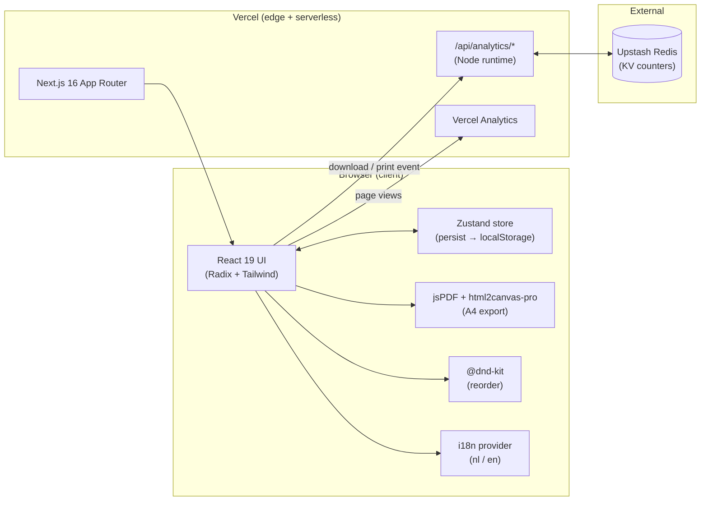
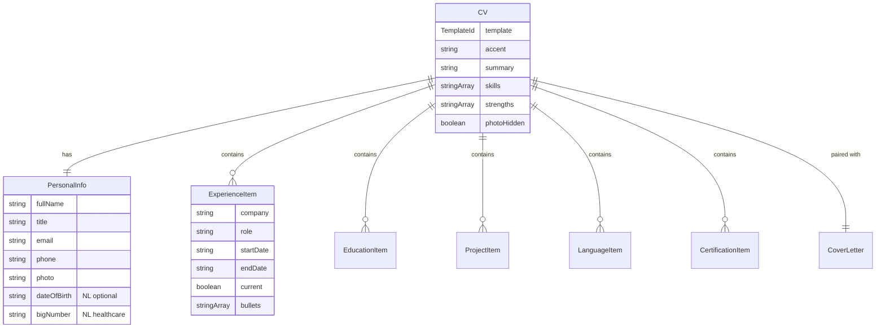

<div align="center">

# MaakMijnCV

**A free, ATS-friendly CV builder for jobseekers in the Netherlands.**
_Built for the [Cybersoek CyberCafé Werk](https://cybersoek.nl/ons-aanbod/cybercafe-werk/) programme in Amsterdam._

[](https://cv-maker-red-sigma.vercel.app/)
[](LICENSE)
[](https://nextjs.org)
[](https://www.typescriptlang.org)
[](https://tailwindcss.com)

<br/>

<a href="https://cv-maker-red-sigma.vercel.app/">
  
</a>

<sub><strong>Try it:</strong> <a href="https://cv-maker-red-sigma.vercel.app/">cv-maker-red-sigma.vercel.app</a> · No sign-up · No paywall · Your data never leaves your browser</sub>

</div>

---

## Table of Contents

- [Overview](#overview)
- [Features](#features)
- [Screenshots](#screenshots)
- [Tech Stack](#tech-stack)
- [Architecture](#architecture)
- [Project Structure](#project-structure)
- [Getting Started](#getting-started)
- [Environment Variables](#environment-variables)
- [Scripts](#scripts)
- [API Reference](#api-reference)
- [Data Model](#data-model)
- [Deployment](#deployment)
- [Development Workflow](#development-workflow)
- [Security & Privacy](#security--privacy)
- [Performance](#performance)
- [Roadmap](#roadmap)
- [Known Limitations](#known-limitations)
- [FAQ](#faq)
- [Contributing](#contributing)
- [Acknowledgements](#acknowledgements)
- [About the Author](#about-the-author)
- [License](#license)

---

## Overview

### The problem

Many candidates supported by the **[Cybersoek](https://cybersoek.nl)** programme in Amsterdam face the same hurdle: a modern, ATS-compatible CV is table stakes for a callback, yet most online CV builders are paywalled, require an account, or produce layouts that automated hiring systems silently reject.

### The solution

**MaakMijnCV** runs entirely in the browser. A candidate picks a template, fills in their details, and downloads a polished A4 PDF — with no sign-up, no server-side storage of personal data, and no paywall.

### Who it's for

| Audience | Why it matters |
| :--- | :--- |
| **Cybersoek participants** | Rebuilding careers via digital-skills coaching |
| **Newcomers to the Dutch labour market** | Need bilingual output and NL-specific fields (BIG, driving licence, work eligibility) |
| **Career switchers** | Industry-specific templates for healthcare, hospitality, tech, retail, education |
| **Coaches & volunteers** | A tool they can hand to a candidate without onboarding |

> [!NOTE]
> This is a solo project — design, engineering, deployment, and copy are all mine. Built and maintained pro bono for Cybersoek.

---

## Features

| Feature | Description |
| :--- | :--- |
| **14 templates** | Industry-specific (healthcare, hospitality, construction, tech, retail, education, admin, delivery, housekeeping) plus minimal, modern, corporate, creative, and creative-bold |
| **ATS-friendly output** | Clean semantic structure that passes automated CV scanners |
| **PDF export** | One-click A4 export via `jspdf` + `html2canvas-pro`, pixel-accurate to the on-screen preview |
| **Native print** | Dedicated print stylesheet — usable without downloading |
| **Optional photo** | Headshot upload on templates where it's appropriate |
| **Drag-and-drop reordering** | Reorder experience items via `@dnd-kit` |
| **Autosave** | Zustand `persist` middleware — progress survives page reloads |
| **60-minute session TTL** | Managed `localStorage` is wiped after an hour of inactivity — privacy-first on shared computers |
| **Cover letter generator** | Matching companion document alongside the CV |
| **Multilingual UI** | Nederlands and English via an in-house `i18n` provider |
| **NL-specific fields** | Optional date of birth, nationality, work eligibility, driving licence, BIG, AGB |
| **Accent colour** | Per-template accent picker |
| **Anonymous usage analytics** | Download and print counters only — no PII, no IP addresses |

---

## Screenshots

| Landing | Editor & live preview |
| :---: | :---: |
| [](https://cv-maker-red-sigma.vercel.app/) | [](https://cv-maker-red-sigma.vercel.app/builder) |

<sub>Additional mobile, tablet, and cover-letter screenshots are on the roadmap.</sub>

---

## Tech Stack

| Technology | Purpose |
| :--- | :--- |
| [Next.js 16](https://nextjs.org) (App Router) | Framework, routing, server components |
| [React 19](https://react.dev) | UI rendering |
| [TypeScript 5](https://www.typescriptlang.org) | Type safety end to end |
| [Tailwind CSS 4](https://tailwindcss.com) | Styling |
| [Radix UI](https://www.radix-ui.com) | Accessible dialog, dropdown, tabs, toast, tooltip |
| [lucide-react](https://lucide.dev) | Icon set |
| [Zustand 5](https://zustand-demo.pmnd.rs) | Client state + `persist` middleware |
| [@dnd-kit](https://dndkit.com) | Sortable sections |
| [jspdf](https://github.com/parallax/jsPDF) + [html2canvas-pro](https://github.com/yorickshan/html2canvas-pro) | Client-side A4 PDF export |
| [Upstash Redis](https://upstash.com) | Anonymous analytics counters |
| [Vercel Analytics](https://vercel.com/analytics) | Page-level traffic |
| Poppins + Noto Sans (`next/font`) | Self-hosted typography |
| ESLint (`eslint-config-next`) | Linting |
| [Vercel](https://vercel.com) | Hosting + preview deploys |

---

## Architecture

MaakMijnCV is a **client-heavy Next.js App Router application**. All CV data lives in the browser; the server handles only two thin analytics endpoints. There is no user database, no auth for end users, and no server-side rendering of user content.



### Key decisions

<details>
<summary><strong>Why client-side state only?</strong></summary>

- Zero backend surface means zero PII risk. Candidate data never leaves the device unless they export a PDF themselves.
- No login barrier — matches the accessibility goals of the Cybersoek programme.
- Autosave via Zustand's `persist` middleware gives instant recovery with no infrastructure to run.

</details>

<details>
<summary><strong>Why <code>html2canvas-pro</code> + <code>jsPDF</code> instead of a headless renderer?</strong></summary>

- Server-side PDF rendering requires serverless Chromium — heavy cold starts, higher cost, no upside for a client-only data flow.
- The client already renders the pixel-perfect preview. Rasterising the DOM to canvas and stitching A4 pages gives a 1:1 export with zero round trips.
- `html2canvas-pro` handles modern CSS (OKLCH, subgrid) that upstream `html2canvas` cannot.

</details>

<details>
<summary><strong>Why a home-grown i18n instead of <code>next-intl</code>?</strong></summary>

- Small dictionary (~200 keys), only two locales.
- No routing-level locale segmentation needed — the switch is fully client-side.
- Zero runtime dependencies, zero bundle bloat.

</details>

<details>
<summary><strong>Why Upstash Redis for analytics?</strong></summary>

- Serverless-native (HTTP, no connection pool).
- Free tier is more than sufficient for two hash keys (`analytics:totals`, `analytics:byDay`).
- Graceful degradation: if `KV_REST_API_*` env vars are missing, the track endpoint no-ops instead of returning 500. This keeps local dev friction-free.

</details>

---

## Project Structure

```text
CV-maker/
├── public/                      # Static assets, screenshots, icons
├── src/
│   ├── app/                     # Next.js App Router entry points
│   │   ├── analytics/           # Password-gated admin dashboard
│   │   ├── api/analytics/
│   │   │   ├── track/           # POST — record download / print event
│   │   │   └── stats/           # GET/POST — read totals + byDay
│   │   ├── builder/             # /builder — the editor route
│   │   ├── layout.tsx           # Root layout, fonts, LocaleProvider, Vercel Analytics
│   │   └── page.tsx             # Marketing landing page
│   ├── components/
│   │   ├── builder/             # Editor shell, toolbar, template + brief pickers
│   │   ├── coverletter/         # Cover letter editor + preview
│   │   ├── editor/              # Form sections (personal, experience, education, …)
│   │   ├── preview/             # Live CV preview surface
│   │   ├── templates/           # 14 template implementations
│   │   │   └── industry/        #  ↳ 10 industry-specific templates
│   │   └── ui/                  # Radix-backed design-system primitives
│   └── lib/
│       ├── analytics-client.ts  # Browser → /api/analytics/track wrapper
│       ├── analytics-store.ts   # Upstash Redis read / write helpers
│       ├── cv-types.ts          # Domain model (CV, Sections, TemplateId, …)
│       ├── i18n.tsx             # LocaleProvider, translate(), Locale = "nl" | "en"
│       ├── pdf.ts               # downloadCVAsPdf() — DOM → A4 PDF
│       ├── sample-cv.ts         # Empty / sample CV factories
│       ├── session.ts           # 60-minute inactivity → wipe managed localStorage
│       ├── skills-data.ts       # Skill / strength chip vocabulary
│       ├── store.ts             # Zustand store (CV, cover letter, template, accent)
│       └── utils.ts             # cn(), uid(), misc
├── AGENTS.md                    # AI agent guidance for this repo
├── eslint.config.mjs
├── next.config.ts
└── tsconfig.json
```

---

## Getting Started

### Prerequisites

- **Node.js** 20 LTS or newer
- **npm** 10+ (ships with Node 20)
- **Git**

### Install & run

```bash
git clone https://github.com/EuvhenRight/CV-maker.git
cd CV-maker

npm install

# Optional — only needed if you want analytics to persist locally
cp .env.example .env.local

npm run dev
```

Open [http://localhost:3000](http://localhost:3000).

### Production build

```bash
npm run build
npm run start
```

---

## Environment Variables

| Variable | Description | Required |
| :--- | :--- | :---: |
| `KV_REST_API_URL` | Upstash Redis REST URL — enables analytics persistence | ❌ |
| `KV_REST_API_TOKEN` | Upstash Redis REST token | ❌ |
| `ANALYTICS_PASSWORD` | Overrides the built-in password for `/analytics` and `/api/analytics/stats` | ⚠️ Recommended in production |

See [`.env.example`](.env.example) for a template you can copy.

> [!WARNING]
> The analytics admin route currently falls back to a hard-coded default when `ANALYTICS_PASSWORD` is unset. **Always override it in any deployed environment.** Fixing this to fail closed is [tracked on the roadmap](#roadmap).

---

## Scripts

| Command | What it does |
| :--- | :--- |
| `npm run dev` | Next.js dev server with HMR on `:3000` |
| `npm run build` | Production build to `.next/` |
| `npm run start` | Serve the production build |
| `npm run lint` | ESLint via `eslint-config-next` |

---

## API Reference

Two Node-runtime routes under `/api/analytics/*`. Both are `force-dynamic`.

### `POST /api/analytics/track`

Anonymous event recorder. No auth.

```http
POST /api/analytics/track
Content-Type: application/json

{ "type": "download" }   // "download" | "print"
```

| Status | Body |
| :---: | :--- |
| `200` | `{ "ok": true }` |
| `400` | `{ "error": "invalid_body" }` or `{ "error": "invalid_type" }` |
| `500` | `{ "error": "write_failed" }` |

### `GET /api/analytics/stats`

Password-gated stats read. Pass the password via `x-analytics-password` header, or via a JSON body on `POST`.

```http
GET /api/analytics/stats
x-analytics-password: <your-password>
```

<details>
<summary><strong>200 — success</strong></summary>

```jsonc
{
  "version": 1,
  "totals": { "download": 1287, "print": 42 },
  "byDay": {
    "2026-07-01": { "download": 12, "print": 1 },
    "2026-07-02": { "download": 7,  "print": 0 }
  }
}
```

</details>

<details>
<summary><strong>401 — unauthorized</strong></summary>

```json
{ "error": "unauthorized" }
```

</details>

---

## Data Model

The domain model is defined in [`src/lib/cv-types.ts`](src/lib/cv-types.ts) and persisted client-side via Zustand under the `cybersoek:cv` key.



### Analytics KV shape

```ts
// Upstash Redis
analytics:totals  → HASH { download: number, print: number }
analytics:byDay   → HASH { "YYYY-MM-DD:download": number, "YYYY-MM-DD:print": number, … }
```

---

## Deployment

The app is deployed on **Vercel** with automatic builds on push to `master` and preview deploys for every PR.

Self-hosting also works — any Node 20+ host will serve `npm run build && npm run start` on `$PORT`. Provide the same environment variables listed above.

> [!NOTE]
> A `Dockerfile` and a GitHub Actions workflow are on the roadmap — the project currently relies on Vercel's built-in CI.

---

## Development Workflow

- **Branching** — `master` is production; feature branches use `feat/<slug>` or `fix/<slug>`.
- **Commits** — short, imperative, lower-case.
- **PRs** — one concern per PR. `npm run lint` and `npm run build` must pass. Include a screenshot for visual changes.
- **Testing** — no automated tests today. Manual QA + Vercel preview deploys. See the [Roadmap](#roadmap) for the plan to add Vitest and Playwright.

---

## Security & Privacy

| Topic | Implementation |
| :--- | :--- |
| **PII handling** | Zero server storage of candidate data. Everything is in the user's browser. |
| **Session expiry** | Managed `localStorage` keys wiped after 60 minutes of inactivity ([`src/lib/session.ts`](src/lib/session.ts)). |
| **Analytics scope** | Two counters only — `download`, `print`. No user IDs, no CV content, no IPs. |
| **Admin auth** | `/analytics` and `/api/analytics/stats` gated by an env-configured password. |
| **Input validation** | `track` route accepts `type ∈ {download, print}`; anything else returns `400`. |
| **Secrets** | Read via `process.env.*`; never bundled to the client. |

### Known security issues

- **Hard-coded fallback password** for the analytics admin when `ANALYTICS_PASSWORD` is unset. Documented, and scheduled to be replaced with a fail-closed check — see [Roadmap](#roadmap).
- **No rate limiting** on `/api/analytics/track`. Not currently a target given the endpoint's shape, but on the roadmap.

If you find a security issue, please open a GitHub issue tagged `security` or contact me directly at the address in [About the Author](#about-the-author).

---

## Performance

- **App Router streaming** for the marketing page; the builder loads as a client bundle only on `/builder`.
- **`next/font`** self-hosts Poppins and Noto Sans — zero external font requests.
- **Client-side PDF pipeline** — no cold-start Chromium; render happens in the user's browser.
- **Zustand persistence** writes only serialised state; ephemeral UI state stays in memory.
- **Fire-and-forget analytics** — the download/print event `POST` never blocks the user action.
- **Static assets** served from `/public` via Vercel's edge cache.

> Lighthouse and Core Web Vitals evidence — on the roadmap alongside the CI work.

---

## Roadmap

**Done**

- [x] 14 industry / classic templates
- [x] PDF export via `jspdf` + `html2canvas-pro`
- [x] Zustand autosave with 60-minute session TTL
- [x] Drag-and-drop section reordering
- [x] Multilingual UI (NL / EN)
- [x] Cover letter generator
- [x] Anonymous analytics with Upstash Redis
- [x] Password-gated admin dashboard

**Next**

- [ ] Replace analytics password fallback with a fail-closed check
- [ ] Vitest unit tests for `lib/` + Playwright happy path for the builder flow
- [ ] GitHub Actions CI — lint, type-check, build on PR
- [ ] Prettier + `lint-staged` pre-commit hook
- [ ] Lighthouse & Core Web Vitals report in the README
- [ ] Rate limiting on `/api/analytics/track`
- [ ] Mobile, tablet, and cover-letter screenshots

**Later**

- [ ] More locales — Arabic (RTL), Turkish, Polish, Ukrainian
- [ ] Import from LinkedIn (URL or JSON export)
- [ ] AI-assisted bullet rewriter (opt-in)
- [ ] Shareable read-only preview links
- [ ] Word (`.docx`) export

---

## Known Limitations

- **PDF fidelity depends on the browser.** Chromium renders best; Firefox and Safari are usable but may differ subtly on complex templates.
- **No automated test coverage yet.** Regressions rely on manual QA and Vercel preview deploys.
- **No offline install / PWA manifest.** The app is offline-*capable* after first load, but not installable.
- **Analytics admin is a shared secret**, not per-user auth — fine for a small internal team, not for wider access.

---

## FAQ

<details>
<summary><strong>Is my CV data saved to a server?</strong></summary>

No. Everything lives in your browser's `localStorage`. The server sees only anonymous counters when you export or print. If you clear browser data, your CV is gone — there is no cloud copy.

</details>

<details>
<summary><strong>Are the templates really ATS-friendly?</strong></summary>

Templates avoid the layout patterns that typically break ATS parsers — no multi-column headers, no text inside images, semantic HTML structure. This is an ongoing effort; if you find a template that a specific ATS mis-parses, please open an issue.

</details>

<details>
<summary><strong>Can I import my existing CV from LinkedIn?</strong></summary>

Not yet — this is on the roadmap. For now, copy the fields in manually. A sample CV starter is available in the builder.

</details>

<details>
<summary><strong>Why Dutch-first?</strong></summary>

The primary audience is jobseekers in the Netherlands, most of whom write CVs in Dutch. The English translation is complete and can be switched with a single click.

</details>

<details>
<summary><strong>How do I add a new template?</strong></summary>

1. Add the template ID to the union in [`src/lib/cv-types.ts`](src/lib/cv-types.ts).
2. Create a component in [`src/components/templates/`](src/components/templates/) (or `industry/` for industry-specific).
3. Register it in [`src/components/templates/index.tsx`](src/components/templates/index.tsx).
4. Add labels to the two dictionaries in [`src/lib/i18n.tsx`](src/lib/i18n.tsx).

</details>

<details>
<summary><strong>Can I self-host this?</strong></summary>

Yes. Any Node 20+ host works. `npm run build && npm run start` and set the environment variables listed above.

</details>

---

## Contributing

Contributions are welcome. For anything larger than a typo or a small fix, please open an issue first so we can align on scope.

1. Fork the repo and create a branch: `git checkout -b feat/my-change`.
2. `npm install`.
3. Make your change — keep it focused.
4. `npm run lint` and `npm run build` must pass.
5. Open a PR with a clear description and a screenshot for visual changes.

---

## Acknowledgements

- **[Cybersoek](https://cybersoek.nl)** — for the mission that made this project worth building.
- **[Radix UI](https://www.radix-ui.com)** — accessible primitives that carry the design system.
- **[Vercel](https://vercel.com)** — hosting and preview deploys.
- **[Upstash](https://upstash.com)** — serverless Redis on the free tier.
- **[lucide-react](https://lucide.dev)** — the icon set.
- **The Dutch labour-market coaches at Cybersoek** — for template feedback and field guidance.

---

## About the Author

Designed, built, and maintained by **[Yevhen Uhnivenko](https://github.com/EuvhenRight)** — full-stack developer based in Amsterdam. Built pro bono for the Cybersoek programme.

| | |
| :--- | :--- |
| **GitHub** | [@EuvhenRight](https://github.com/EuvhenRight) |
| **Email** | [ugnivenko.ea@gmail.com](mailto:ugnivenko.ea@gmail.com) |
| **Programme** | [cybersoek.nl](https://cybersoek.nl) |

---

## License

Released under the [MIT License](LICENSE). © [Yevhen Uhnivenko](https://github.com/EuvhenRight) · built for [Cybersoek](https://cybersoek.nl).
